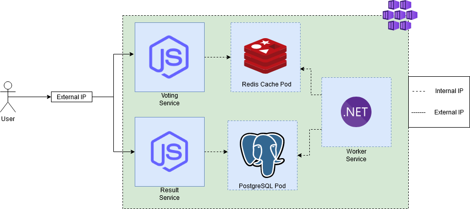
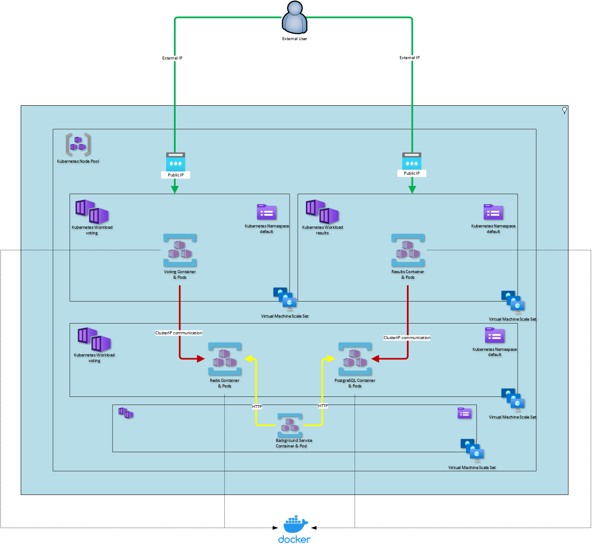

# Kubernetes-QuickStart



## Full Cluster Design


<!-- ABOUT THE PROJECT -->
## About The Project

Kubernetes is an open-source platform for managing containerized workloads and service. Azure Kubernetes Service (AKS) makes it simple to deploy and manage a cluster of virtual machines that are running Kubernetes. To get started with AKS, you'll first need to create a new AKS cluster using the Azure Portal or Azure CLI. Once the cluster is up and running, you can deploy and manage your applications using Kubernetes commands and tools. The AKS documentation provides detailed instructions on how to create a new cluster, as well as how to deploy and manage your applications. With AKS, you can easily scale your applications yo meet demand and ensure high availability.

What we'll do:
* Spin up two public front-end services as containers for users to interact with.
* Spin up a PostgreSQL and Redis data store as a container to handle data movement from one FE service to another.
* Spin up a dotnet worker service to handle transferring data from our PostgreSQL database to Redis.

### Built With

Kubernetes allows you to have multiple frameworks running on a single Kubernetes cluster. Kubernetes is a container orchestration platform that can manage multiple containerized applications simultaneously. Each application can be deployed using a different framework, and Kubernetes will handle the scheduling and scaling of those container.

This AKS cluster includes the following services:
* [![Svelte][Svelte.dev]][Svelte-url]
* [![Next][Next.js]][Next-url]
* [![Vue][Vue.js]][Vue-url]
* [![React][React.js]][React-url]
* [![Angular][Angular.io]][Angular-url]

<!-- GETTING STARTED -->
## Getting Started

This is an example of how you may give instructions on setting up your project locally.
To get a local copy up and running follow these simple example steps.

### Prerequisites

You will need an Azure account, you can create a free Azure account with a $200 credit at [https://www.azure.microsoft.com/free](https://azure.microsoft.com/en-us/free/search/?OCID=AIDcmm5edswduu_SEM_8f2b03ad4bfd15c5099060679d974953:G:s&ef_id=8f2b03ad4bfd15c5099060679d974953:G:s&msclkid=8f2b03ad4bfd15c5099060679d974953)

You will also need Ubuntu [https://learn.microsoft.com/en-us/windows/wsl/install](https://learn.microsoft.com/en-us/windows/wsl/install)

### Installation

_Once you have created an Azure account, you will want to follow these commands in order to create your Azure Kubernetes Service cluster._

1. Login through the AZ CLI
   ```sh
   az login
   ```
2. Create an AKS cluster
   ```sh
   az aks create -g "$RG" -n "$AKSCluster" --node-count 2 --generate-ssh-keys
   ```
3. Install Kubectl utility
   ```sh
   sudo apt update
   curl -fsSL https://packages.cloud.google.com/apt/doc/apt-key.gpg | sudo tee /usr/share/keyrings/kubernetes.gpg
   echo "deb [arch=amd64 signed-by=/usr/share/keyrings/kubernetes.gpg] http://apt.kubernetes.io/ kubernetes-xenial main" | sudo tee -a /etc/apt/sources.list
   sudo apt-mark hold kubeadm kubelet kubectl
   sudo apt install kubeadm kubelet kubectl
   kubeadm version
   ```
4. Connect to your AKS cluster
   ```sh
   az aks get-credentials -g "$RG" -n "$AKSCluster"
   ```
5. Verify your connection
   ```sh
   kubectl get all
   ```

<!-- LICENSE -->
## License

Distributed under the MIT License. See `LICENSE.txt` for more information.

<!-- MARKDOWN LINKS & IMAGES -->
<!-- https://www.markdownguide.org/basic-syntax/#reference-style-links -->
[contributors-shield]: https://img.shields.io/github/contributors/othneildrew/Best-README-Template.svg?style=for-the-badge
[contributors-url]: https://github.com/othneildrew/Best-README-Template/graphs/contributors
[forks-shield]: https://img.shields.io/github/forks/othneildrew/Best-README-Template.svg?style=for-the-badge
[forks-url]: https://github.com/othneildrew/Best-README-Template/network/members
[stars-shield]: https://img.shields.io/github/stars/othneildrew/Best-README-Template.svg?style=for-the-badge
[stars-url]: https://github.com/othneildrew/Best-README-Template/stargazers
[issues-shield]: https://img.shields.io/github/issues/othneildrew/Best-README-Template.svg?style=for-the-badge
[issues-url]: https://github.com/othneildrew/Best-README-Template/issues
[license-shield]: https://img.shields.io/github/license/othneildrew/Best-README-Template.svg?style=for-the-badge
[license-url]: https://github.com/othneildrew/Best-README-Template/blob/master/LICENSE.txt
[linkedin-shield]: https://img.shields.io/badge/-LinkedIn-black.svg?style=for-the-badge&logo=linkedin&colorB=555
[linkedin-url]: https://linkedin.com/in/othneildrew
[product-screenshot]: images/screenshot.png
[Next.js]: https://img.shields.io/badge/-dotnet-red
[Next-url]: https://learn.microsoft.com/en-us/dotnet/core/introduction
[React.js]: https://img.shields.io/badge/-Kubernetes-blue
[React-url]: https://kubernetes.io/
[Vue.js]: https://img.shields.io/badge/-javascript-brightgreen
[Vue-url]: https://www.javascript.com/resources
[Angular.io]: https://img.shields.io/badge/-PostgreSQL-lightgrey
[Angular-url]: https://www.postgresql.org/
[Svelte.dev]: https://img.shields.io/badge/-Redis-orange
[Svelte-url]: https://redis.io/docs/about/
[Laravel.com]: https://img.shields.io/badge/Laravel-FF2D20?style=for-the-badge&logo=laravel&logoColor=white
[Laravel-url]: https://laravel.com
[Bootstrap.com]: https://img.shields.io/badge/Bootstrap-563D7C?style=for-the-badge&logo=bootstrap&logoColor=white
[Bootstrap-url]: https://getbootstrap.com
[JQuery.com]: https://img.shields.io/badge/jQuery-0769AD?style=for-the-badge&logo=jquery&logoColor=white
[JQuery-url]: https://jquery.com 
